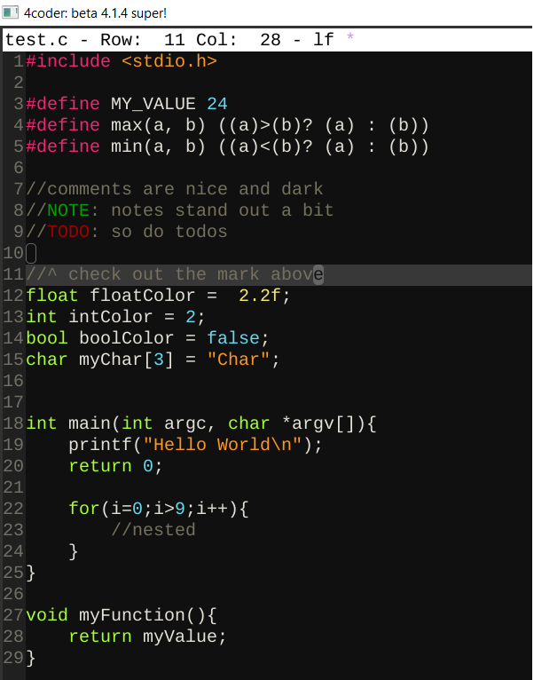
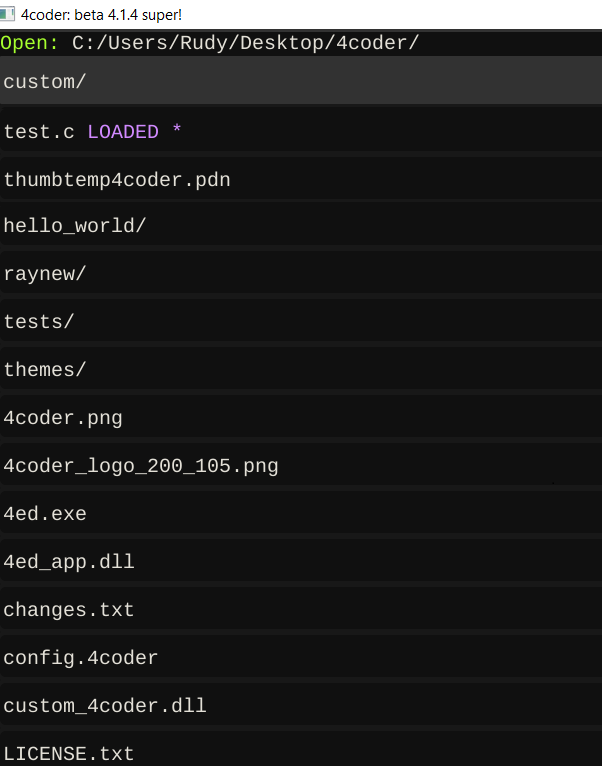

# 4Coder custom theme rfaile313 "mod-monokai"
### This is my custom 4coder theme based losely on a monokai pallette.

### The goal is to offer a nice level of readable contrast without being too bright in any one place.

## C Program Example:

## 4coder navigation example

## Installation:

Add theme-mod-monokai.4coder to your `themes` folder in your 4coder directory, then load using `alt+x` (command) `theme...`
